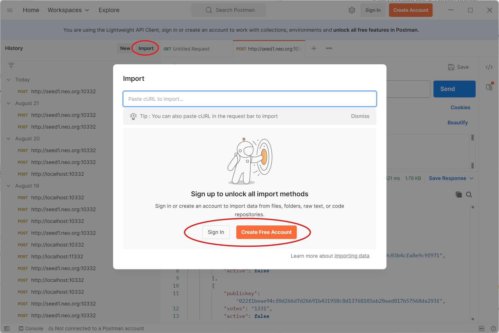
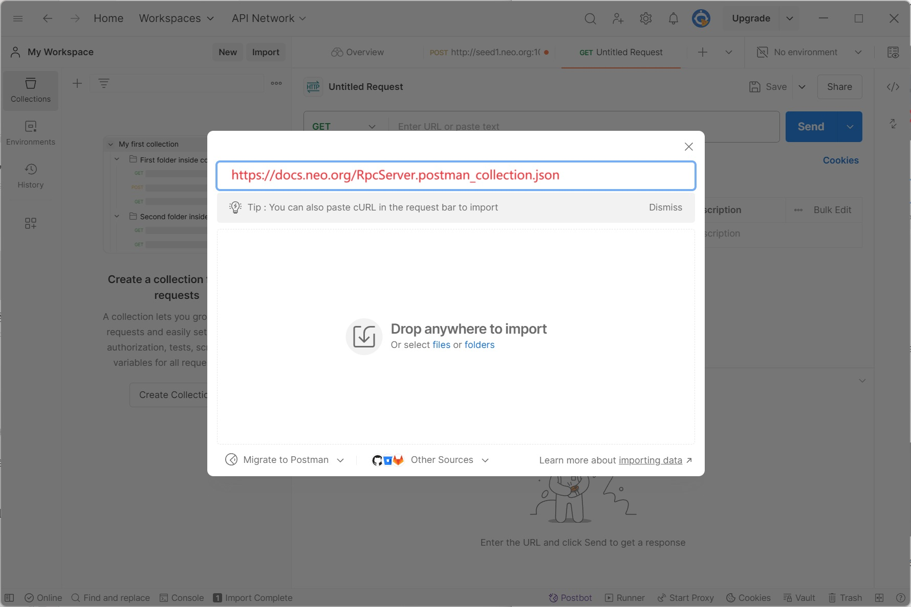
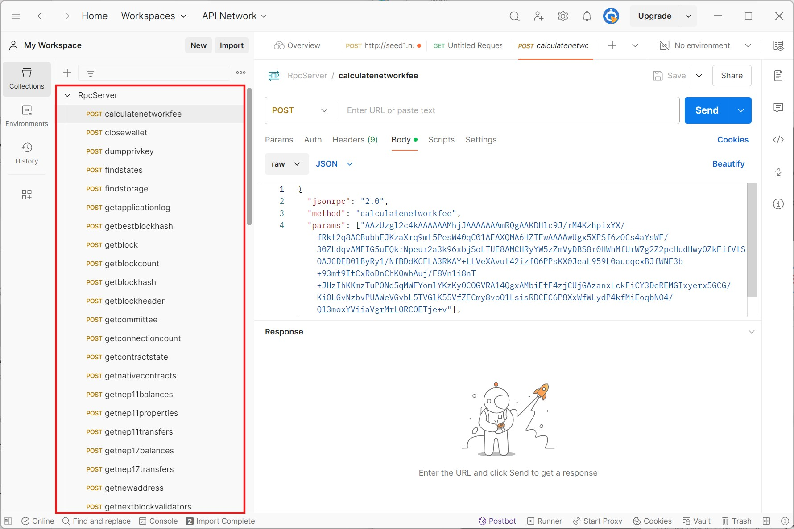

# NeoDocsToPostmanJson

A tool to convert Neo RPC documents into postman exported json data.

## How to use

### Manually generated

- Download or clone the GitHub project https://github.com/neo-project/neo-dev-portal
- Go to the project folder and then to the `n3\reference\rpc` folder and copy the path,
  such as `D:\neo-dev-portal\n3\reference\rpc`
- Run the project and enter the path
- Generate Postman exported json data
- The generated results will be output on the console and in the `RpcServer.postman_collection.json` file

### Using online links (recommend)

You can use this link to import directly into Postman

https://docs.neo.org/RpcServer.postman_collection.json

